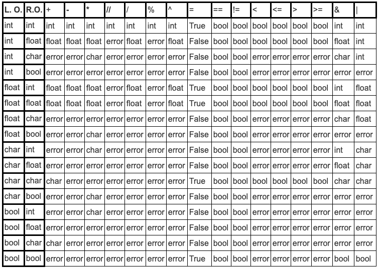

# MyR

***
### Tabla de Contenidos
- [MyR](#myr)
    - [Tabla de Contenidos](#tabla-de-contenidos)
  - [DESCRIPCION](#descripcion)
  - [REQUISITOS](#requisitos)
  - [INSTALACION](#instalacion)
  - [MANUAL DE USUARIO](#manual-de-usuario)
    - [COMPILACION/EJECUCION](#compilacionejecucion)
    - [ESTRUCTURA](#estructura)
    - [VARIABLES](#variables)
    - [FUNCIONES](#funciones)
        - [Declaración de funciones](#declaración-de-funciones)
        - [Llamado de funciones](#llamado-de-funciones)
    - [EXPRESIONES](#expresiones)
    - [CONDICIONALES](#condicionales)
    - [CICLOS](#ciclos)
    - [VECTOR](#vector)
    - [ESTADISTICOS](#estadisticos)
  - [ENTREGAS](#entregas)

***
## DESCRIPCION
**MyR** es un lenguaje de programación estilo C++, que está enfocado en realizar operaciones básicas de un lenguaje de programación común, añadiendo funciones estadísticas simples (media, moda, regresión lineal). 

***
## REQUISITOS
La aplicación no tiene requerimientos técnicos más allá que la descarga del lenguaje de programación 'python3' y el módulo o paquete 'ply' que en muchos de los casos ya lo tiene integrado el mismo lenguaje de programación.

***
## INSTALACION
Si se requiere instalar ply teclearemos lo siguiente en la terminal para instalar las librerias necesarias:
`pip install ply`

***
## MANUAL DE USUARIO
***
### COMPILACION/EJECUCION
Python 3 MyR.py Pruebas/*nombreArchivo.txt*
Python 3 MyRmv.py Pruebas/*nombreArchivo.o*

Con el primer archivo (*nombreArchivo.txt*) viene la estructura general del archivo. Al correrlo con el archivo *MyR.py* se generan los cuadruplos que seran ejecutados por la maquina virtual

***
### ESTRUCTURA 
A continuación se muestra un ejemplo de archivo (*text1.txt*) donde se muestra la estructura general un archivo para trabajar en **MyR**:

`program test1; *%%Nombre*`

`var *%%declaracion variables globales*`
    `int i,j,p;`

`funcion void calcula(int y) { *%%declaracion funciones*`
    `var int x;`
    `x = 1;`
`}`

`main() { *%%funcion main de ejecucion principal*`
    `read(p);`
    `j = p * 2;`
    `calcula(p - 1);`
    `write(j);`
`}`

***
### VARIABLES
Existen tres tipos de variables a declarar:
* Int
* Float
* Char

Podemos encontrar variables globales y locales dentro del programa. La declaracion para los dos casos es la misma, solo varia en donde fueron declaradas (posterior a nombrar al Program fuera de una función, o dentro de una función)

Para la declaracion de variables se sigue la siguiente estructura:

`var`
`    int i,j,p;`
`    float valor;`

***
### FUNCIONES
Existen tres tipos de funciones a declarar:
* Con valor de retorno 
  * Int
  * Float
  * Char
* Sin valor de retorno
  * Void
* Main

##### Declaración de funciones
``funcion valor_retorno nombre_funcion(parametro1) {``
``    return resultado; %%si aplica``
``}``

##### Llamado de funciones
`nombreFuncion(parametro);`
`nombreFuncion();`
Para el llamado de funciones se puede realizar dentro del main o alguna otra función.

El main al fungir como responsable del funcionamiento general del programa, no requiere llamada.

***
### EXPRESIONES
* Aritmeticas ( + , - , / , // , * , % , ^ )
* Logicas ( & , | )
* Relacionales ( < , > , >= , <=)

Consideraciones para compatibilidad de datos

***
### CONDICIONALES
El siguiente es un ejemplo de la estructura de un estatuto condicional:
`if (  Expresion_relacional ) then` 
`{`
`	%%INSTRUCCION_CUMPLIR`
`}`
`else`
`{`
``  %%INSTRUCCION_RECHAZO``
``}``
***
### CICLOS
El siguiente es un ejemplo de la estructura de un estatuto for:
`for x = 1 to 10` 
`do {`
`	%%INSTRUCCION_CUMPLIR`
``}``

Consideracion importante: El ciclo for solo va incrementando de uno en uno.

El siguiente es un ejemplo de la estructura de un estatuto while:
``while(i < j)`` 
``do {``
`	%%INSTRUCCION_CUMPLIR`
    ``i = i + 1;``
``}``
***
### VECTOR
Para el uso de vectores, primero necesitamos declarar nuestro tipo de vector + un nombre + corchetes con el tamaño (n) del vector [ n ]
``var``
``   int vec[10];``
``    vec[0] = 2; ``
``    vec[1] = 5;``
``    vec[2] = 6;``
``    vec[3] = 9;``
``    vec[4] = 7;``
``    vec[5] = 10;``
``    vec[6] = 1;``
``    vec[7] = 3;``
``    vec[8] = 3;``
``    vec[9] = 7;``

***
### ESTADISTICOS
Se agregaron funciones integradas al programa para uso de vectores destinadas al calculo estadistico de procedimientos simples.
* media: Media de un conjunto de numeros
  ``media(vec);``
* mediana: Mediana de un conjunto de numeros
  ``mediana(vec);``
* moda: Moda de un conjunto de numeros
  ``moda(vec);``
* varianza: Varianza de un conjunto de numeros
 ``varianza(vec);``
* esdev: Desviacion estandar de un conjunto de numeros
  ``esdev(vec);``

***
## ENTREGAS
AVANCE 1 - SCANNER Y PARSER - 100%
AVANCE 2 - DIRECTORIO PROC + TABLA VARIABLES - 100%
AVANCE 3 - CUBO SEMANTICO + EXP ARITMETICAS - 100%
AVANCE 4 - ESTATUTOS ASIGNACION/LECTURA/ESCRITURA + IF - 100%
AVANCE 5 - CICLOS - 100%
AVANCE 6 - FUNCIONES + MAQUINA VIRTUAL - 100% 
AVANCE 7 - ARREGLOS - 100%
AVANCE 8 - DOCUMENTACION + EJEC MODULOS Y ARREGLOS + MAQUINA VIRTUAL - 90%
FIN